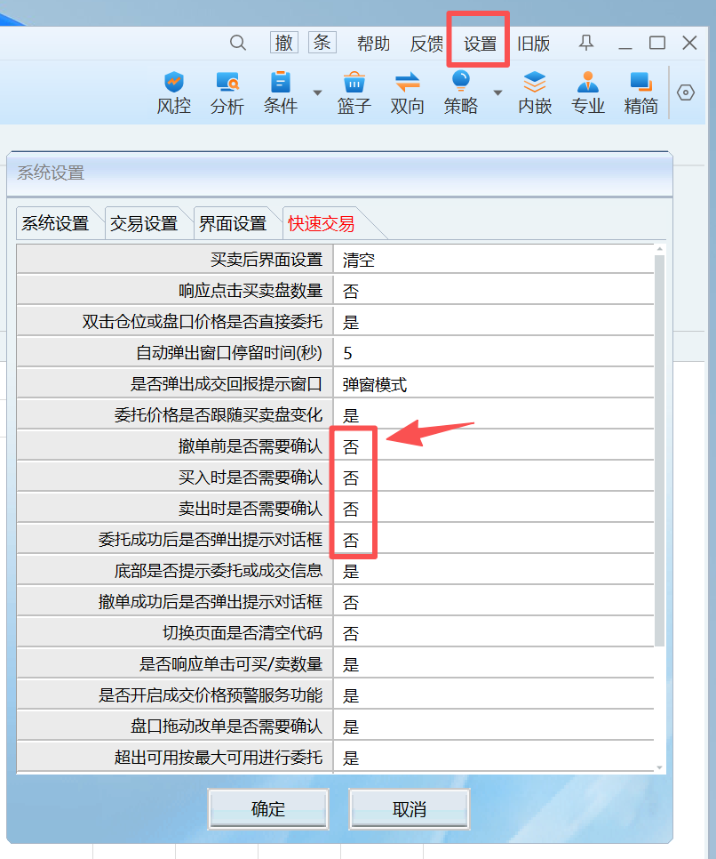

# RHTHS

## 设计初衷：让 AI 真正连接交易

RHTHS 是面向 **Agent、量化策略与交易工具** 的**独立 AI 交易网关**：在本机把行情、账户与交易能力，以及多源金融数据能力，收敛为统一的 **MCP / CLI** 入口，并提供从部署到联调的技术支持——目标是让 AI **真正连上交易**，而不是停留在「只会聊天、下不了单」。

### 卖点不是数据

**我们不售卖、不转售金融数据。**  
A 股研究类云端数据依托 **[同花顺金融数据服务](https://fuyao.aicubes.cn/)**（官方标准 API · 开源契约 [HiThink-Tech/Financial-API](https://github.com/HiThink-Tech/Financial-API)）。**API Token 由用户自行在官网申请、自行保管与付费**；RHTHS 仅按标准协议转发，不代持密钥、不替代官方签约。

RHTHS 的工程价值在于：**多数据节点融合**（本机行情/交易 + 官方云端研究数据等）→ **给 AI 一个统一入口** → **降低接入与维护成本**。数据权限、额度与计费以同花顺金融数据服务账号及官方条款为准。

| 我们是 | 我们不是 |
|--------|----------|
| AI / 策略 ↔ 本机交易与多源数据的**技术网关** | 数据卖方、数据转售平台 |
| **技术咨询、远程协助部署与联调**的服务方 | 券商、代客理财或投资顾问 |
| 本机 MCP / CLI **统一入口**的维护者 | 「同花顺金融数据 API」产品本身 |

### 作者如何收费（请先读）

收费与服务的**首要内容**是：**技术咨询、远程协助部署、联调排障**等工程支持（**为服务付费**）；产品授权（标准版 / 高级版）对应的是网关与工程能力，**不包含**同花顺金融数据服务的数据用量或 Token。收款 / 发票请备注 **「技术服务费（RHTHS 网关）」**。交易资金与盈亏风险由用户自行承担；请遵守该数据服务条款、THS / 券商规则及当地法律法规。版本对比、服务范围与常见问题见介绍单页：[https://www.miaolink.cn/rhths/aitradegw.html](https://www.miaolink.cn/rhths/aitradegw.html)。

### 关系声明与责任边界（法律风险切割）

| 边界 | 说明 |
|------|------|
| **与官方的关系** | RHTHS 为**独立第三方**技术网关 / 辅助工具，**不是**同花顺、券商或 [同花顺金融数据服务](https://fuyao.aicubes.cn/) / HiThink 的官方产品，**不构成**代理、经销、加盟或背书关系。 |
| **数据** | 不生产、不售卖、不转售金融数据；云端研究数据请求由用户 **自有 Token** 发往官方服务，费用与合规义务在用户与官方之间。本机行情来自用户已安装并登录的 THS 环境，亦非作者出售的数据包。 |
| **交易** | **不提供**云端「官方交易 API」、不托管资金账户、不代客下单。下单/查仓仅在用户本机、经用户已登录的 THS / 下单环境执行；是否允许程序化交易以 **THS 用户协议与券商规则**为准。 |
| **AI / 策略** | MCP/CLI 只提供**技术调用通道**。AI 或策略给出的分析、荐股话术、买卖信号**不构成**投资建议；实盘须用户显式确认（如 `confirm_live`），后果由用户自负。 |
| **远程协助** | 协助范围限于安装、配置、连通与排障。即使经用户同意远程连线，**默认不代为下单或操盘**；账户与资金操作权始终在用户。 |
| **准确性与可用性** | 不对行情、财务、涨停池等第三方返回数据的完整性、及时性、准确性作保证；不对 THS / 官方 API / 网络中断导致的损失承担责任。 |

### 实务纪律（防击穿 · 必读）

文案切割会被**实务行为**击穿。请作者与用户共同遵守：

1. **宣传口径**：对外（微信 / 视频 / 海报）勿称「同花顺官方」「官方合作」「送数据包」；统一为「独立第三方 AI 交易网关 · 技术服务」。  
2. **收款与发票**：备注 **「技术服务费（RHTHS 网关）」**；勿只写「卖数据 / 行情包」。  
3. **远程协助**：仅排障；**不代客下单、不代操盘、不给买卖点**。连线前口头确认：「只装环境 / 查连通，不下单」。  
4. **程序化合规**：用户须自行确认 THS / 券商是否允许程序化；默认模拟，实盘须显式确认。  
5. **网络安全**：MCP / 网关默认仅本机；**勿**把 `0.0.0.0` 暴露到公网；勿把未授权交易机交给他人远程控制。  
6. **AI 话术**：作者侧不主动荐股；用户侧理解 AI 输出≠投资建议。

> 使用本软件即视为知悉并接受上述边界。争议条款以本站 [免责声明](https://www.miaolink.cn/rhths/index.php) 及适用法律为准。本文档定位陈述**不构成法律意见**；重大合规问题请咨询专业律师。

> 文中 **THS** 均指相关 PC 行情交易客户端（免费版 / 金融大师 / 远航版 / 券商定制版 / 独立下单 xiadan 等）。

**一句话：** 面向 THS PC 用户的**独立第三方 AI 交易网关** — 通过 MCP / CLI 对接本机已登录账户完成查仓与下单；可选将用户自有 Token 的研究类请求转发至同花顺金融数据服务官方 API。适用于 **WorkBuddy**、**Codex**、**Hermes Agent**（及 OpenClaw / Cursor 等）与本机量化脚本。

在线文档：[https://www.miaolink.cn/rhths/index.php](https://www.miaolink.cn/rhths/index.php) · MCP 配置详见 [MCP使用说明.md](./MCP使用说明.md)

## 说人话

1. 本机 THS 能登录交易（含模拟）→ 装好 RHTHS 后，可用 MCP / CLI **查仓、下单**（默认模拟）。  
2. 需要财报、估值、涨停池等研究数据 → 到 [同花顺金融数据服务](https://fuyao.aicubes.cn/admin/) **自己申请 API Key**，在控制台「**API**」页保存 → 调用走官方标准接口。  
3. 重叠的实时行情 / 交易仍优先本机；缺的研究类数据再走官方云端 API。  
4. 装不上、MCP 连不上、要远程协助 → **优先找作者做技术支持**（见下方联系方式）；服务主体是工程协助，不是「买数据包」。

## 技术路线：本机交易入口 + 官方标准数据 API

RHTHS **不是**「找窗口 → 模拟点击 → OCR 读屏」类界面自动化。交易与账户相关能力走本机已登录的 THS / 下单环境；研究类金融数据统一转发至 **同花顺金融数据服务官方标准 API**（用户自备 Token）。

| | 常见界面自动化 | RHTHS |
|---|----------------|--------|
| 交易 / 账户 | 模拟鼠标键盘、读屏 | 本机已登录客户端环境（非读屏主路径） |
| 金融研究数据 | 爬页 / 非标接口 | **同花顺金融数据服务** 官方 REST / MCP 契约 |
| Token | — | **用户自行申请**，写入本机配置，不上传给第三方 |

> **说明：** 云端数据用量与权限以同花顺金融数据服务账号及官方条款为准。实盘须遵守券商与 THS 规则；RHTHS**标准版**对实盘买卖有每日次数保护（高级版无此限制）。

```text
常见界面自动化：AI/脚本 ──► 模拟点击 THS 窗口
RHTHS 交易：    AI/脚本 ──► 本机网关 ──► 已登录 THS / 下单环境
RHTHS 数据：    AI/脚本 ──► 官方标准 API（fuyao.aicubes.cn，用户自有 Token）
```

---

## 联系作者（技术咨询与远程协助）

**服务主体：** 技术咨询、远程协助部署、MCP / 局域网联调排障、标准版 / 高级版激活与授权说明。微信通常比自行排查更快。

| 项目 | 内容 |
|------|------|
| **联系人** | 李先生 |
| **手机** | [18670334431](tel:18670334431) |
| **微信** | 同上号码（**推荐**：添加时请备注「RHTHS」+ 简要问题） |
| **产品介绍** | [AiTradeGW / RHTHS 介绍单页](https://www.miaolink.cn/rhths/aitradegw.html)（版本对比、服务范围、常见问题） |


> 说明：作者收费以**技术服务**为主（咨询 / 远程部署 / 联调），不是出售金融数据包。远程协助**不代客下单或操盘**。交易与资金风险由用户自行承担；不提供代客理财或投资建议。云端数据 Token 请自行向同花顺金融数据服务申请。RHTHS **非**同花顺/券商官方产品。完整条款见本站底部「使用条款与免责声明」。介绍与选型见 [aitradegw.html](https://www.miaolink.cn/rhths/aitradegw.html)。

## AI 交易（首选：WorkBuddy · Codex · Hermes Agent）

在 **WorkBuddy**、**Codex** 或 **Hermes Agent** 里配置 RHTHS 的 MCP 服务 **`rhths-trade`** 后，可用自然语言调用本机账户查询与下单通道（默认**模拟下单**，实盘须显式确认）。**AI 输出不构成投资建议**；是否下单由用户决定。也可在 OpenClaw / Claw、Cursor 及其他支持 MCP 的客户端中接入（与介绍页 [AiTradeGW](https://www.miaolink.cn/rhths/aitradegw.html) 推荐顺序一致）。

| 你可以对 AI 说 | MCP 背后能力 |
|----------------|--------------|
| 「帮我看下资金和持仓」 | `rh_trade_account`、`rh_trade_positions` |
| 「今天有哪些委托」 | `rh_trade_orders_today` |
| 「模拟买入 100 股某某，最新价」 | `rh_trade_buy`（`dry_run`） |
| 「问财选市盈率小于 20 的票」 | `rh_market_wencai`、`rh_market_select_stocklist` |
| 「恢复策略运行 / 条件单 resume」 | `rh_condition_resume`（需已有 `signal_id`） |
| 「启动下单程序 xiadan」 | `rh_system_start_xiadan` |
| 「切换到实盘模式」（需谨慎） | `rh_trade_mode_set` + `confirm_live` |
| 「查茅台估值 / 利润表 / 今天涨停池」（用户自备官方 Token） | `rh_fuyao_*`（同花顺金融数据服务） |

完整话术与**全部 MCP 工具**示例见 **[AI交易示例.md](./AI交易示例.md)**。

**推荐客户端（优先顺序与购买页一致；配置方式相同，合并 `rhths-trade` 即可）：**

1. **WorkBuddy** — 首选  
2. **Codex** — 次选  
3. **Hermes Agent** — 第三优先（本机命令或远程 URL）  
4. 亦可：**OpenClaw / Claw**、**CodeBuddy**、**Cursor**、Claude Desktop、Windsurf、Cline、Continue、Cherry Studio 及其他支持 MCP 的客户端  

**机读配置模板：** [mcp.server.rhths-trade.json](./mcp.server.rhths-trade.json) · 工具列表：[mcp.tools.json](./mcp.tools.json) · **AI 自动安装：** [AI自动安装MCP与SKill示例.md](./AI自动安装MCP与SKill示例.md)

```text
你 ──对话──► WorkBuddy / Codex / Hermes Agent（等）──MCP──► rhths-mcp.exe（统一入口）
  ├─► 本机已登录 THS / 下单环境     ← 查仓 · 实时行情 · 下单（优先）
  └─► 同花顺金融数据服务官方标准 API ← 财务 / 估值 / 特色数据等（用户自有 Token）
```

**RHTHS** 作为本机 **MCP / CLI 统一入口**：**交易与账户**走你已登录的 PC 客户端；**金融研究数据**一律按 [同花顺金融数据服务](https://fuyao.aicubes.cn/) **官方标准 API** 调用（开源说明见 [Financial-API](https://github.com/HiThink-Tech/Financial-API)）。请在官网 [自行申请 API Key](https://fuyao.aicubes.cn/admin/)，于 GUI「**API**」页保存；密钥仅存本机，由你本人对调用与费用负责。

---

## 适配哪些 THS ？

以下 **THS PC 端** 在「能登录并交易、且本机策略 / 交易 Python 环境可用」的前提下，可与 RHTHS 配合使用：

| 客户端类型 | 说明 |
|------------|------|
| **PC 免费版** | 个人常用免费客户端 |
| **金融大师** | 完整行情与交易环境 |
| **远航版** | 远航系列 PC 客户端 |
| **券商定制版** | 各券商冠名、定制的 THS PC 版 |
| **独立下单（xiadan）** | THS 独立下单程序，与主客户端配合或单独使用 |

> **交易**依赖你本机已登录的 THS / 下单环境与券商权限。**金融数据**请使用 [同花顺金融数据服务](https://fuyao.aicubes.cn/admin/) **自行申请的官方 API Token**（GUI「API」页填写）；RHTHS 按官方标准协议转发，不代替你签约或充值。THS 或券商若另有程序化要求，以官方规定为准。

### 安装后三步

1. 安装 **RHTHS** 安装包（含 `rhths-gui.exe`、`rhths.exe`、`rhths-mcp.exe`） 
2. 在 GUI 中执行 **「安装 / 更新扩展」**（或运行安装包自带部署脚本） 
3. **启动 THS（或独立下单）并登录** → 运行 `rhths health` 显示正常 → 即可配置 **WorkBuddy / Codex / Hermes Agent**（或其它 MCP 客户端）或运行 **CLI**

---

## 谁可以直接用？

> 使用上表任一 THS PC 客户端、且已能手动登录下单、本机策略 / 交易环境可用的用户：安装 RHTHS 并完成扩展部署后，可用 MCP / CLI 做查询与下单。

| 常见做法 | RHTHS 做法 |
|----------|------------|
| 界面模拟点击 | 本机已登录客户端环境（非读屏主路径） |
| 研究数据靠爬站 / 非标接口 | **同花顺金融数据服务**官方标准 API（**用户自申请 Token**） |
| 为 AI 单独开发交易接口 | **WorkBuddy / Codex / Hermes** 等配 MCP 即可对话查仓、下单 |
| 持仓与 PC 不一致 | 交易查询走本机已登录账户，与客户端一致 |

**不提供：** 第三方云交易接口托管、迁移到其它交易系统品牌、**MySQL 或其它数据库同步**（属其它非标集成）。

> **与旧 thsQuant 的关系：** RHTHS**不连接** `:19090` / `:18989`。若你曾用 thsQuant，请改用本机 **`http://127.0.0.1:19312`** 与 `rhths` / `rhths-mcp`；两套程序可并存但互不依赖。

建议先用 **模拟（dry-run）** 验证 AI 与策略，再按需实盘（风险自负）。

---

## 软件能做什么

| 能力 | 说明 |
|------|------|
| **`ths_api` 网关** | 进程内 Python 调用；查询 / 模拟无第三方按次配额 |
| **AI 交易（MCP）** | **WorkBuddy、Codex、Hermes Agent** 等通过对话查资金 / 持仓 / 委托、问财选股、模拟或实盘买卖 |
| **量化脚本（CLI）** | `rhths.exe` 供 PowerShell、计划任务、Python 等本机自动化 |
| **交易查询** | 资金账号、资金、持仓、当日 / 历史委托 |
| **下单与撤单** | 买入、卖出、撤单；默认模拟，实盘需 `confirm_live` |
| **行情与选股** | 实时行情、K 线、分时、盘口、板块、问财、5 日因子、指标（本机优先） |
| **同花顺金融数据服务** | 用户自申请官方 Token；MCP `rh_fuyao_*` / CLI `rhths fuyao` 走**官方标准 API**（财务、估值、日历、涨停/龙虎榜、基金、消歧等） |
| **条件单 / 策略** | 进程内信号引擎（经本机网关） |
| **进程管理** | 启动 / 停止 `hexin.exe`、`xiadan.exe`（CLI / MCP / GUI） |
| **自动交易审核** | 本地 JSON 配置与审核队列（可选，非 MySQL） |
| **图形管理** | `rhths-gui.exe`：扩展部署、交易面板、**API（官方 Token）**、激活、升级 |
| **产品授权** | RHTHS 标准版 / 高级版（产品注册码）；标准版实盘有每日次数保护 |

---

## 两种使用方式

| 优先级 | 方式 | 适用场景 |
|--------|------|----------|
| **AI 交易** | **[MCP](./MCP使用说明.md)** `rhths-mcp.exe` | **WorkBuddy / Codex / Hermes**（本机 stdio）；笔记本 AI 连家里交易机（HTTP） |
| 量化 / 运维 | **[CLI](./CLI使用说明.md)** `rhths.exe` | 本机脚本、批处理、计划任务 |

---

## 核心组件

| 组件 | 说明 |
|------|------|
| **rhths-mcp.exe** | **AI 交易入口**（MCP → 网关 19312） |
| **RhThsHost.dll** | THS 进程内网关（默认本机 `127.0.0.1:19312`） |
| **rhths.exe** | CLI 量化 / 调试 |
| **rhths-gui.exe** | 扩展部署、激活、日常管理 |
| **扩展模块** | 部署到 THS 策略环境的网关模块 |

---

## 环境要求

- **Windows 10/11**
- **THS PC 端**之一：免费版 / 金融大师 / 远航版 / 券商定制版 / 独立下单（xiadan），能登录交易，且策略 / 交易 Python 环境可用
- **RHTHS** 已安装且扩展已部署
- **AI 交易（可选）**：**WorkBuddy / Codex / Hermes Agent**（亦可 Cursor / OpenClaw）+ [MCP使用说明.md](./MCP使用说明.md)

### 独立下单（xiadan.exe）必设项（唯一配置入口）

RHTHS 通过 `ths_api` 程序化下单时，**必须在 `xiadan.exe` 里完成下图设置**（其它客户端无此替代路径）。打开方式：独立下单窗口顶部菜单 **「设置」** → 选项卡 **「快速交易」**，将图中标注的 **4 项全部设为「否」**：

| 设置项 | 必须值 |
|--------|--------|
| 撤单前是否需要确认 | **否** |
| 买入时是否需要确认 | **否** |
| 卖出时是否需要确认 | **否** |
| 委托成功后是否弹出提示对话框 | **否** |



> **说明：** 若上述任一项为「是」，程序化委托可能被确认框或弹窗阻塞，导致 MCP/CLI 下单超时或失败。修改后点击 **「确定」** 保存，并**完全退出后重新启动 `xiadan.exe`**（部署扩展 后亦须重启）。

---

## 快速开始

1. 启动 THS 并登录 
2. `rhths.exe health` → `ok: true` 
3. **AI 交易**：配置 WorkBuddy / Codex / Hermes Agent → [MCP使用说明.md](./MCP使用说明.md) · 话术 [AI交易示例.md](./AI交易示例.md) 
4. **量化脚本** → [CLI使用说明.md](./CLI使用说明.md) 
5. 首次安装 → [快速开始.md](./快速开始.md)

---

## 文档目录

| 文档 | 内容 |
|------|------|
| [软件功能图.md](./软件功能图.md) | **控制台界面截图**（概览 / 交易 / API / 自选 / 激活 / 设置 / MCP 等） |
| [作者自用应用案例.md](./作者自用应用案例.md) | **融合 Agent 工作台/交易室** 真实用法（自选、板块、主线、联动） |
| [AI交易示例.md](./AI交易示例.md) | **WorkBuddy / Codex / Hermes** 自然语言话术与全工具示例 |
| [SKILL.md](./SKILL.md) | **Agent 融合指南**（MCP + CLI，供首选客户端及 OpenClaw 等加载） |
| [fuyao-routing.md](./fuyao-routing.md) | 云端 `rh_fuyao_*` 产品侧路由（工作台用 Skill `rhths-fuyao`） |
| [MCP使用说明.md](./MCP使用说明.md) | **WorkBuddy / Codex / Hermes** 等本机与局域网配置 |
| [AI自动安装MCP与SKill示例.md](./AI自动安装MCP与SKill示例.md) | **一句话让 AI 自动安装 MCP + Skill**（本机 / 局域网） |
| [快速开始.md](./快速开始.md) | 安装检查 |
| [远程协助服务范围.md](./远程协助服务范围.md) | **远程协助可做/不做**（防击穿） |
| [CLI使用说明.md](./CLI使用说明.md) | 命令行参考 |
| [mcp.server.rhths-trade.json](./mcp.server.rhths-trade.json) | MCP 配置模板 |
| [mcp.tools.json](./mcp.tools.json) | 工具名与参数摘要 |

---

## 架构示意

```text
 本机 THS / 下单环境 ──► 本机网关 ──┐
                                    ├─► rhths-mcp / rhths（统一入口）
 同花顺金融数据服务官方标准 API ────┘
   （用户自行申请并保管 Token）
```

---

## 使用说明与合规提示

请用户知悉并合规使用：

| 项目 | 说明 |
|------|------|
| **产品定位** | RHTHS 是**独立第三方** **AI 交易网关 / 统一入口**（MCP / CLI）：卖点是多节点融合与工程接入，**不是**金融数据销售，**不是**同花顺/券商官方产品 |
| **官方数据 API** | 云端取数遵循 [同花顺金融数据服务](https://fuyao.aicubes.cn/) / [Financial-API](https://github.com/HiThink-Tech/Financial-API) 契约；**Token 由用户自行申请、自行保管与付费**，RHTHS 不代持他人密钥、不转售数据、不保证第三方数据准确 |
| **商业服务** | 作者收费重点为 **技术咨询、远程协助部署与联调**（为服务付费）；收款备注「技术服务费」；产品授权对应网关工程能力，**不含**官方数据用量；远程协助**不代客操盘** |
| **交易能力** | **非**云端官方交易 API；基于用户本人合法持有的账户与本机已登录的 THS / 下单环境；默认模拟，实盘风险自负；程序化是否允许以 THS/券商规则为准 |
| **AI / 策略** | 仅技术通道；分析与信号**不构成**投资建议；实盘须用户确认 |
| **实务纪律** | 勿称官方/数据包；MCP 勿公网裸奔；远程只排障；详见文首 [实务纪律](#实务纪律防击穿--必读) |
| **用户责任** | 须遵守**同花顺金融数据服务条款**、**THS 用户协议**、**券商交易规则**及所在地法律法规；建议先模拟验证 |
| **禁止用途** | 代客理财、非法荐股、操纵市场、侵入他人账户、规避监管或未授权远程控制他人交易机等 |
| **关系声明** | 与同花顺 / 券商 / 金融数据服务方**无**代理、经销或官方背书关系；详见文首 [关系声明与责任边界](#关系声明与责任边界法律风险切割) |

> 数据权限、额度与计费以同花顺金融数据服务账号为准；程序化交易相关要求以 THS / 券商最新条款为准。

---

## 许可与免责

- **产品许可**：RHTHS 标准版 / 高级版在 GUI 激活（网关与工程能力；**非**数据包）。  
- **官方数据 Token**：请自行在 [fuyao 管理端](https://fuyao.aicubes.cn/admin/) 申请；与 RHTHS 产品注册码相互独立。  
- **合规**：禁止将本产品用于盗版、未授权访问他人账户等违法行为。  
- **免责声明**：资金与交易风险由用户自行承担，详见本站页面底部 [免责声明](https://www.miaolink.cn/rhths/index.php)。  
- **技术支持（服务主体）**：李先生 · [18670334431](tel:18670334431)（微信同号，二维码见文首 [联系作者](#联系作者技术咨询与远程协助)）— 技术咨询 / 远程协助部署与联调。

---

> 面向**最终用户**与 **AI 助手**。开发构建见主仓库 `README.md`、`docs/`。
