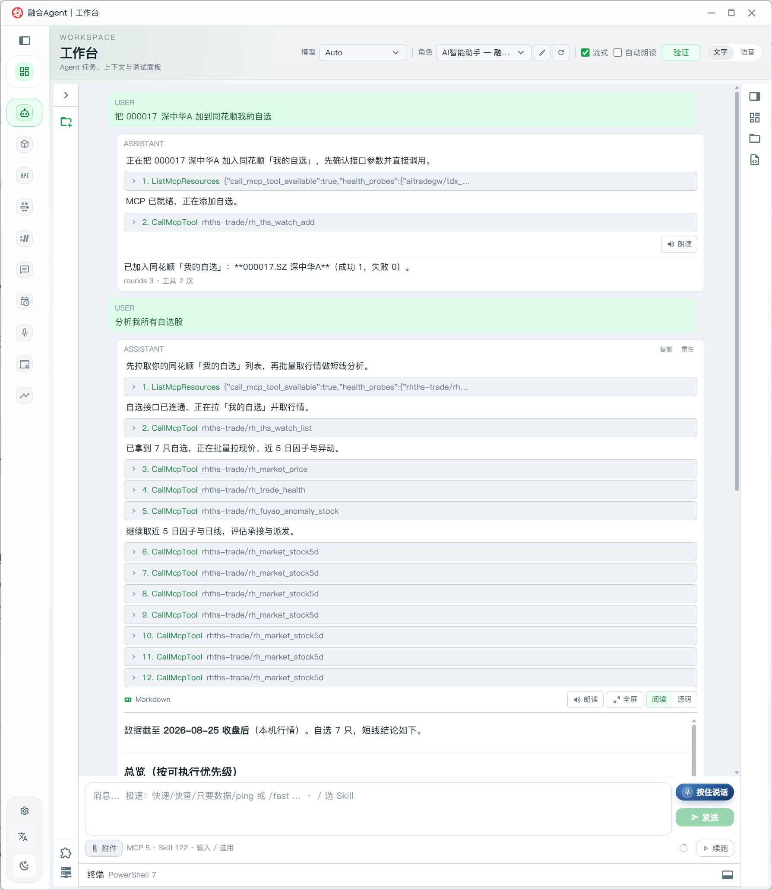
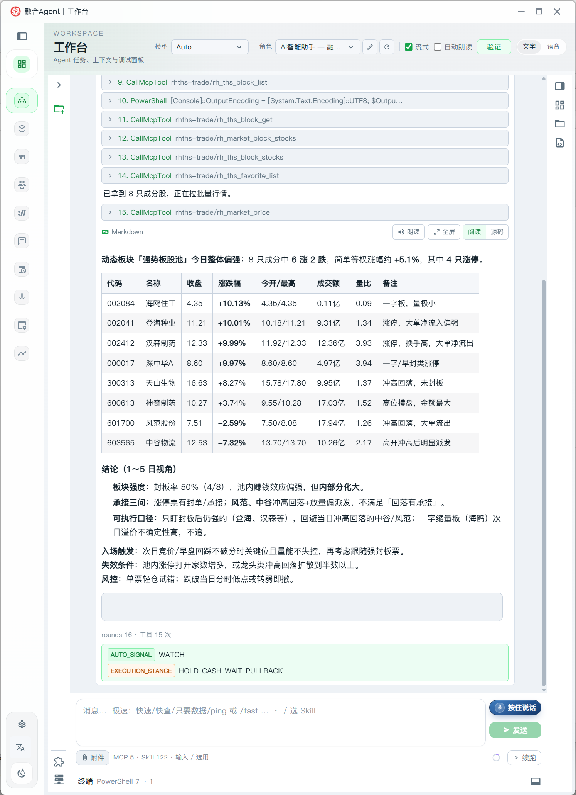
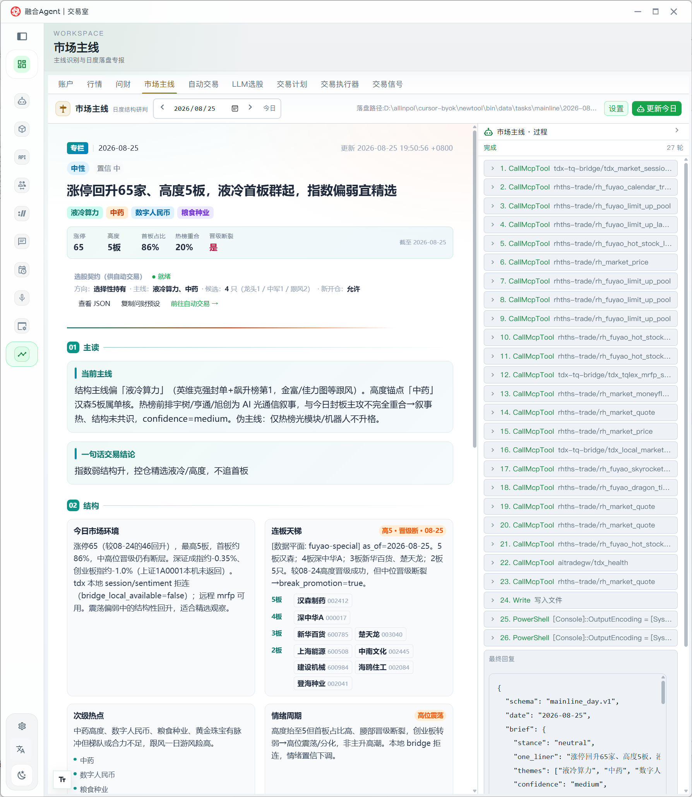
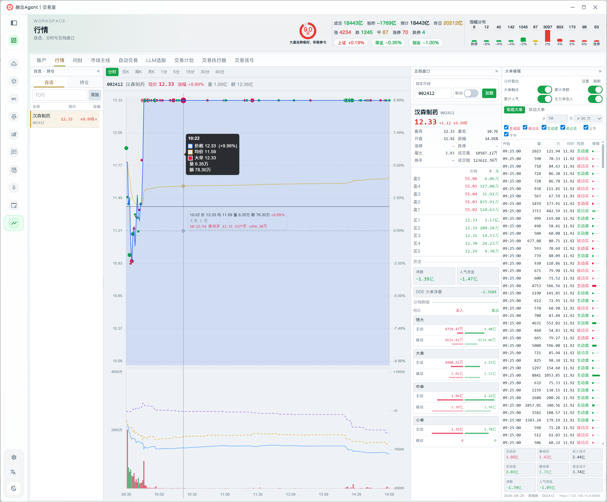
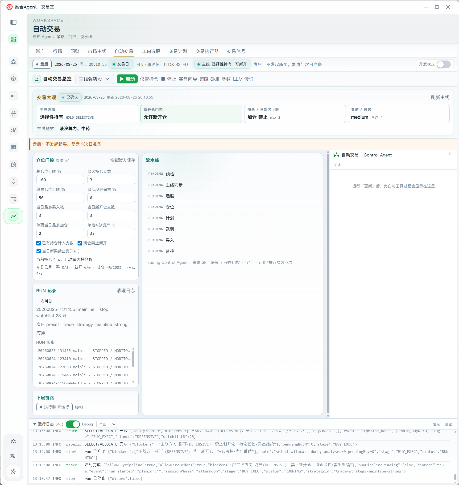
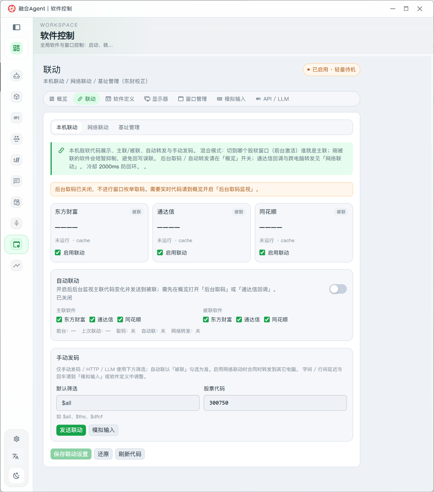

# 作者自用应用案例

本文记录作者日常如何把 **RHTHS MCP**（`rhths-trade`）接到 **融合 Agent 工作台 / 交易室**，用自然语言完成自选管理、板块复盘、市场主线、自动交易流水线与行情联动。截图为真实本机界面，仅作使用示意，**不构成投资建议**。

相关说明：[MCP使用说明.md](./MCP使用说明.md) · [AI交易示例.md](./AI交易示例.md) · [SKILL.md](./SKILL.md)

---

## 场景总览

| 截图 | 界面 | 在做什么 |
|------|------|----------|
| [图 0](#0-工作台对话自选管理与复盘) | 融合 Agent · 工作台 | 对话加自选、拉自选列表、批量行情/异动分析 |
| [图 1](#1-工作台动态板块复盘) | 融合 Agent · 工作台 | 读动态板块成分，出短线结构结论 |
| [图 2](#2-交易室市场主线) | 融合 Agent · 交易室 | 日度「市场主线」：涨停池 / 天梯 / 情绪，右侧可见 MCP 调用链 |
| [图 3](#3-交易室行情自选与分时) | 融合 Agent · 交易室 | 自选 + 分时 + 五档 + 大单，盯盘与交易同屏 |
| [图 3b](#3b-交易室自动交易流水线) | 融合 Agent · 交易室 | 「自动交易」：仓位门控、流水线、RUN 记录与运行日志 |
| [图 4](#4-软件控制多端联动) | 融合 Agent · 软件控制 | 东财 / 通达信 / 同花顺 代码联动（主联 / 被联 / 手动发码） |

---

## 0. 工作台：对话自选管理与复盘



**怎么用**

1. 对 AI 说：「把 000017 深中华A 加到同花顺的自选」  
2. Agent 调用 `rh_ths_watch_add`（可只传 6 位代码，MCP 侧会自动补市场，如 `000017.SZ`）  
3. 再说：「分析我所有自选股」→ `rh_ths_watch_list` 拉列表，再批量 `rh_market_price` / `rh_market_stock5d` / `rh_fuyao_anomaly_stock` 等出结论  

**要点**：自选读写走云端 Cookie（GUI「自选」页）；行情与账户能力走本机 RHTHS 网关。一条对话串起「改列表 → 看数据 → 给优先级」。

---

## 1. 工作台：动态板块复盘



**怎么用**

1. 「查看动态板块 XXX 今天表现如何」  
2. Agent 用 `rh_ths_block_list`（及成分相关工具）拿到成分，再 `rh_market_price` 批量报价  
3. 输出涨跌家数、涨停/回落分化、1～5 日可执行口径（入场 / 失效条件）  

作者自用时，动态板块当作「当日强势样本池」，不替代人工确认；信号标签如 `WATCH` / `HOLD_CASH_WAIT_PULLBACK` 仅作流程备忘。

---

## 2. 交易室：市场主线



**怎么用**

- 交易室页签 **「市场主线」** →「更新今日」  
- 右侧「过程」可见一串 MCP：日历、涨停池、行情、健康检查等（含 `rh_fuyao_*` 与本机 `rh_market_*`）  
- 中间产出：主读结论、连板天梯、情绪周期、主题标签  

适合开盘前 / 收盘后做**结构研判**；与工作台闲聊互补——一个偏报告固化，一个偏即时问答。

---

## 3. 交易室：行情 · 自选与分时



**怎么用**

- **行情**页：左侧自选 / 持仓，中间分时，右侧五档与大单捕捉  
- 自选可在交易室本地添加代码，也可由工作台经 `rh_ths_watch_*` 改同花顺云端自选后，再在此盯盘  
- 顶栏为大盘成交与涨跌家数等概览，便于切票时对照情绪  

作者习惯：工作台负责「改池子、写结论」，交易室负责「盯一只票的盘口」。

---

## 3b. 交易室：自动交易流水线



**怎么用**

- 交易室页签 **「自动交易」**：看交易大观（方向 / 开仓门 / 加仓限制 / 候选与主题）  
- 左侧 **仓位门控**（总仓、只数、单票上限、日买入次数等）与 **RUN 记录**  
- 中间 **流水线**：预检 → 主线同步 → 选股 → 仓位 → 计划 → 武装 → 买入 → 监控（图中为 PENDING，盘后待机）  
- 右侧 **Control Agent** 过程区；底部 **运行日志** 可见策略阶段与门控拦截原因  

与 RHTHS 的关系：流水线落地时走本机网关 / MCP（如 `rh_trade_*`、行情与主线数据）；作者自用时盘后先对齐主线与门控，交易时段再开 RUN，**模拟优先，实盘须显式确认**。

---

## 4. 软件控制：多端联动



**怎么用**

- **软件控制 → 联动**：配置东财、通达信、同花顺主联 / 被联  
- 需要实时跟窗时，在概览打开「后台取码」；也可 **手动发码**（如图中 `300750`）点「发送联动」  
- 与 RHTHS 的关系：RHTHS 管 MCP/网关与同花顺交易扩展；联动页管多软件**同代码跟票**，减少来回切窗  

---

## 推荐日常闭环（作者自用）

```text
开盘前
  交易室「市场主线」更新今日 → 看主线 / 天梯 / 情绪
工作中
  工作台对话：改自选、问板块、批量复盘（rh_ths_* + rh_market_* + rh_fuyao_*）
盯盘
  交易室「行情」看分时 / 五档 / 大单；多软件联动跟代码
策略执行（如开）
  交易室「自动交易」对齐门控与流水线后再 RUN
下单（如需）
  RHTHS 控制台或 MCP rh_trade_*（模拟优先，实盘显式确认）
```

| 能力 | 优先 MCP / 入口 |
|------|-----------------|
| 我的自选增删查 | `rh_ths_watch_*` |
| 自选板块 / 动态板块 | `rh_ths_favorite_*` / `rh_ths_block_*` |
| 本机行情 | `rh_market_*` |
| 云端特色 / 涨停池等 | `rh_fuyao_*`（GUI「API」Token） |
| 账户买卖 / 自动流水线 | `rh_trade_*` · 交易室「自动交易」 |

---

## 环境备忘

1. 本机已安装并登录同花顺；RHTHS 扩展已部署，`rhths-mcp` 可用（工作台状态栏可见 MCP 数）。  
2. 云端自选：在 `rhths-gui` **「自选」** 页保存 Cookie。  
3. 云端研究数据：在 **「API」** 页配置自有金融数据 Token。  
4. Skill 使用 `rhths-trade`（见 [SKILL.md](./SKILL.md)），对话里直接说业务意图即可，不必记工具名。  

截图版本以实际界面为准；功能迭代后图注可能略有差异。
