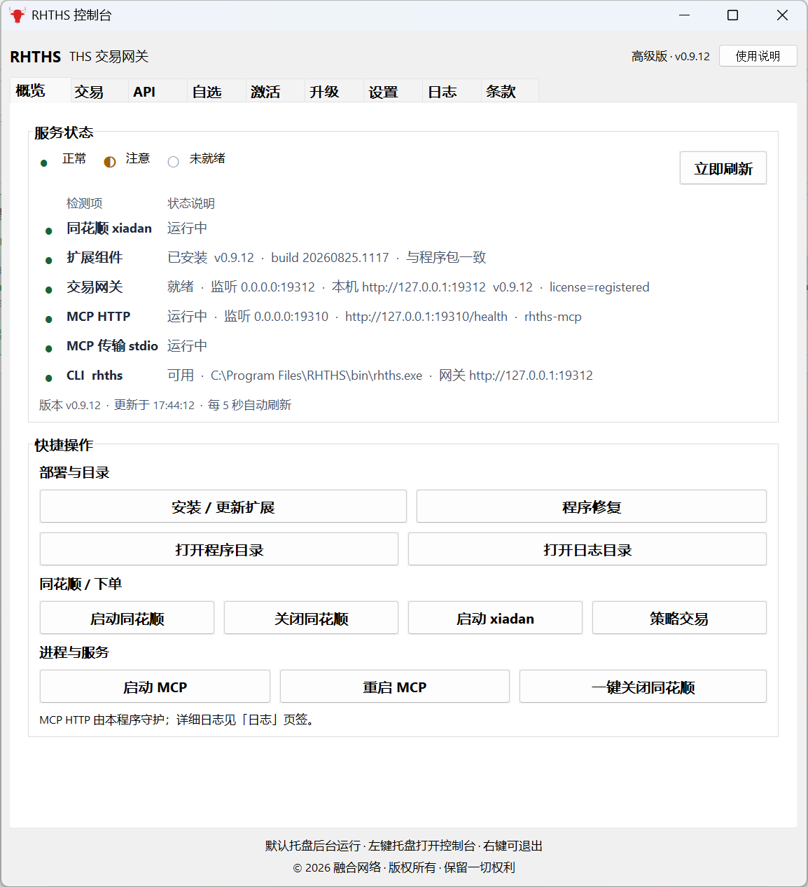
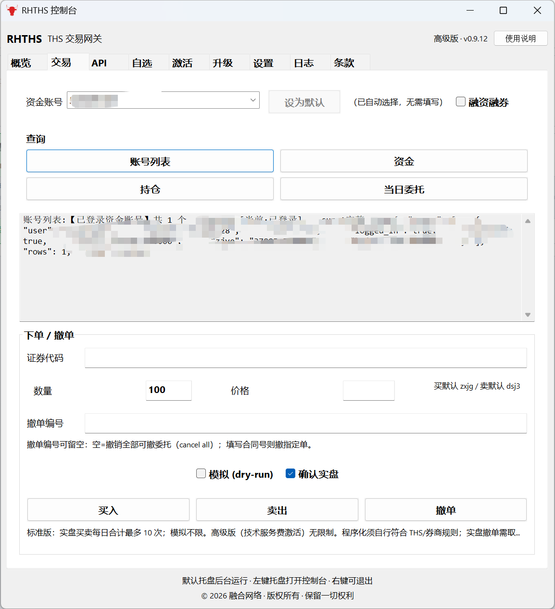
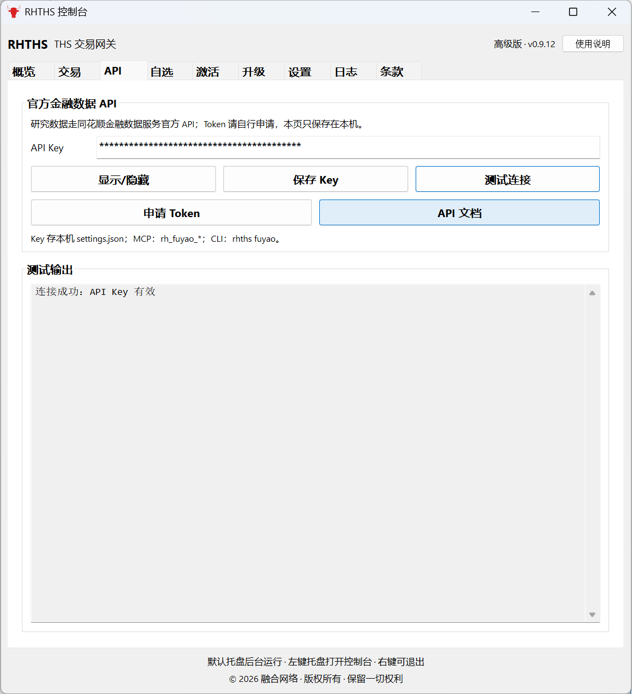
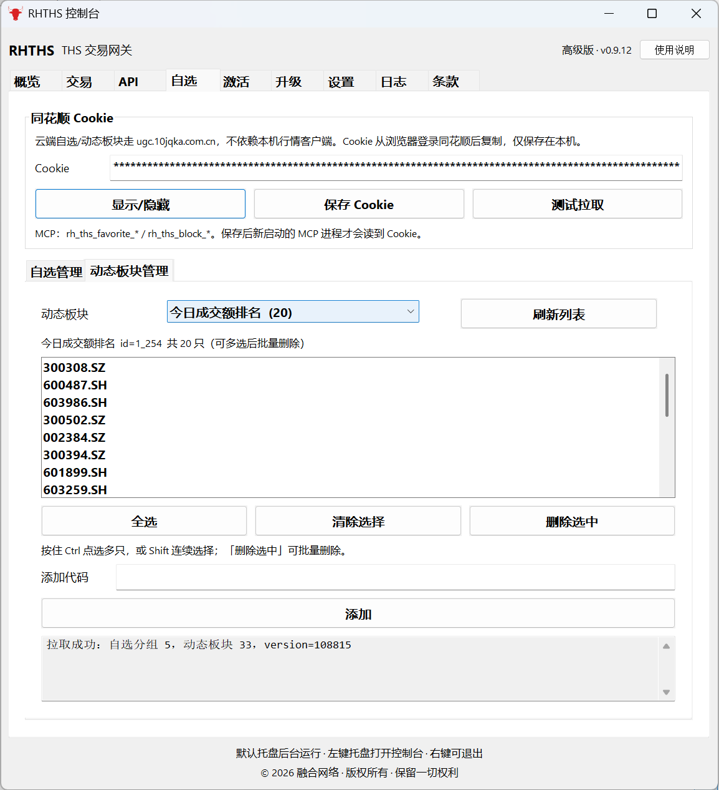
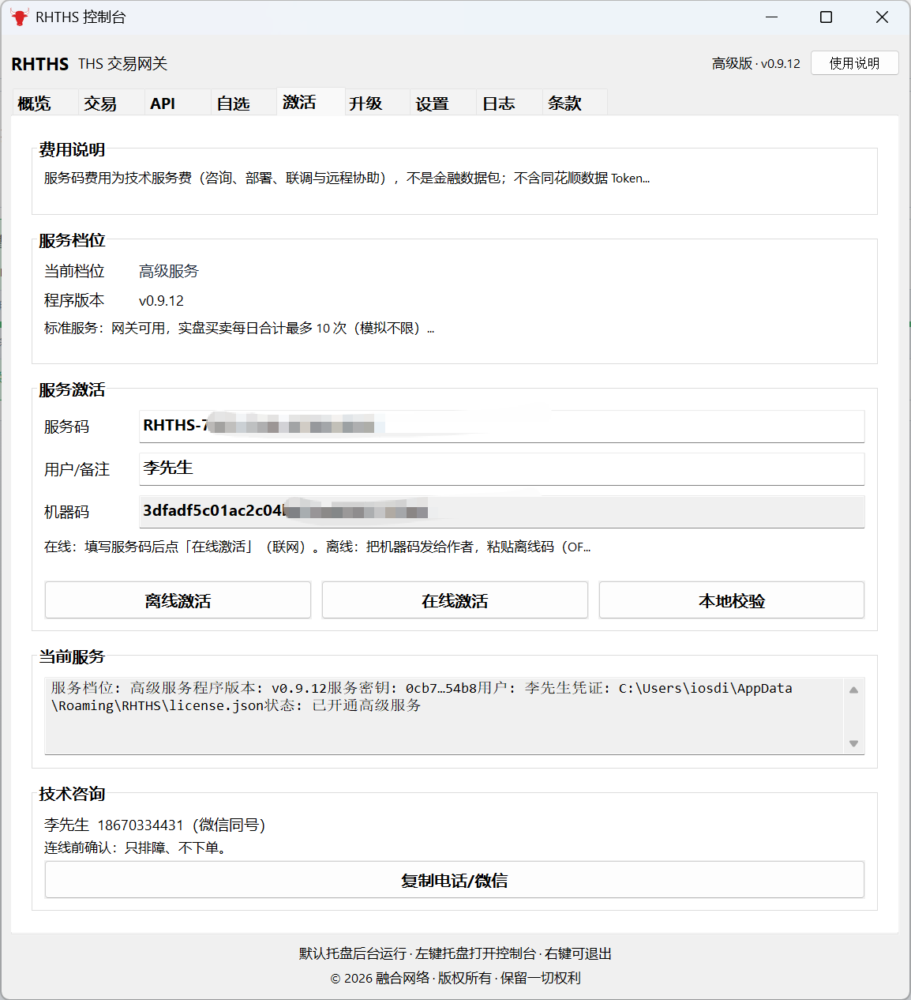
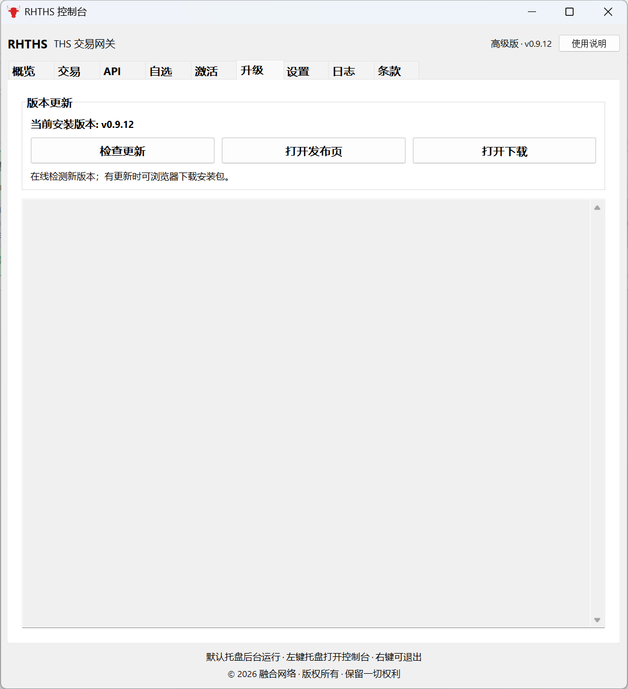
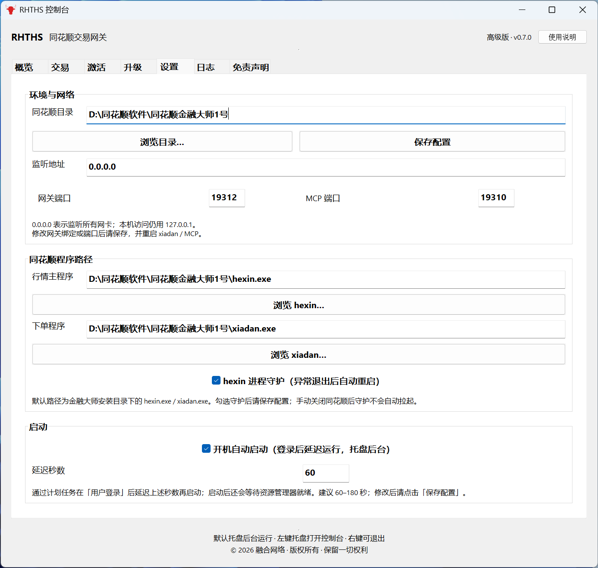
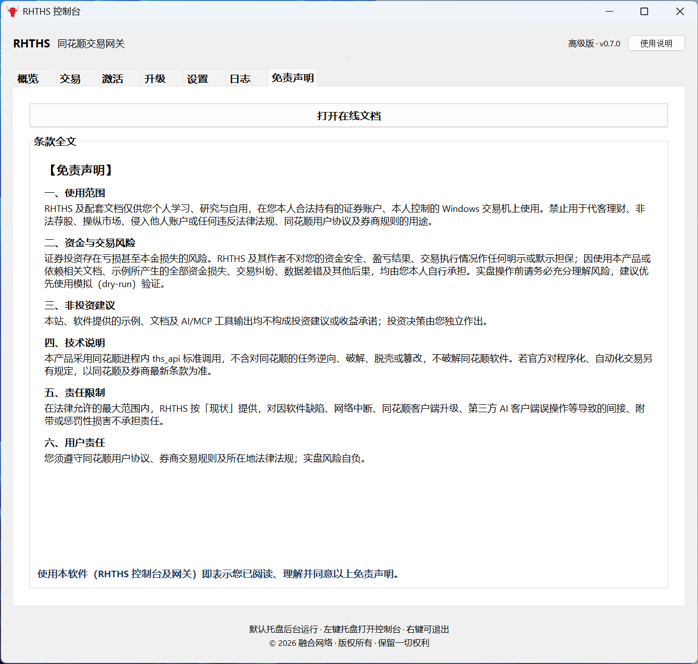
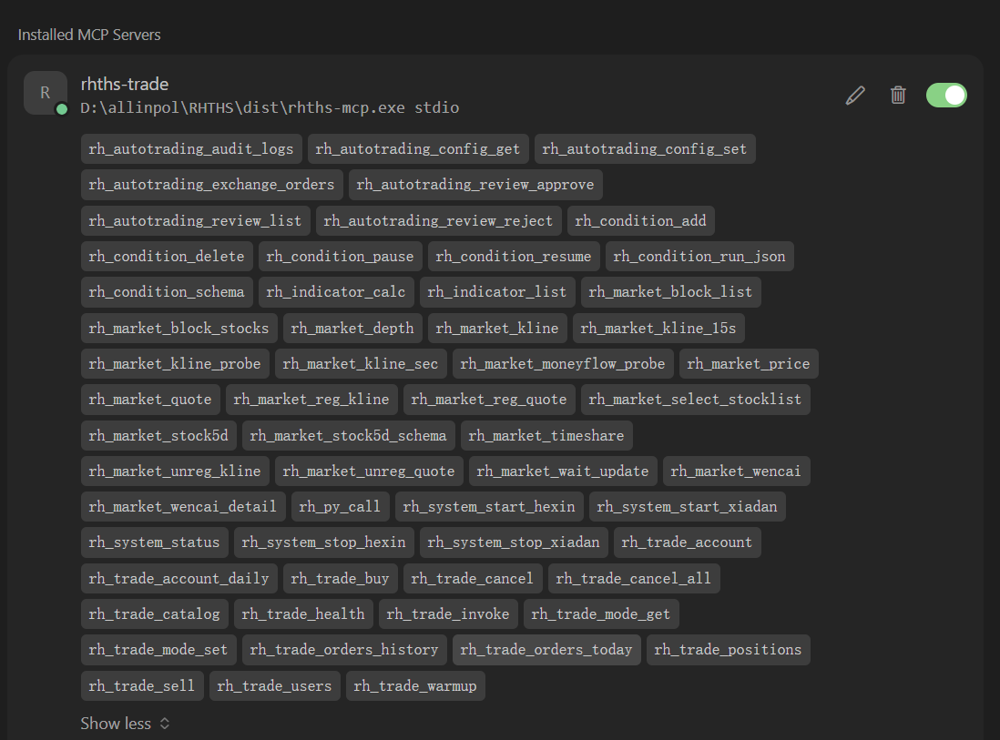
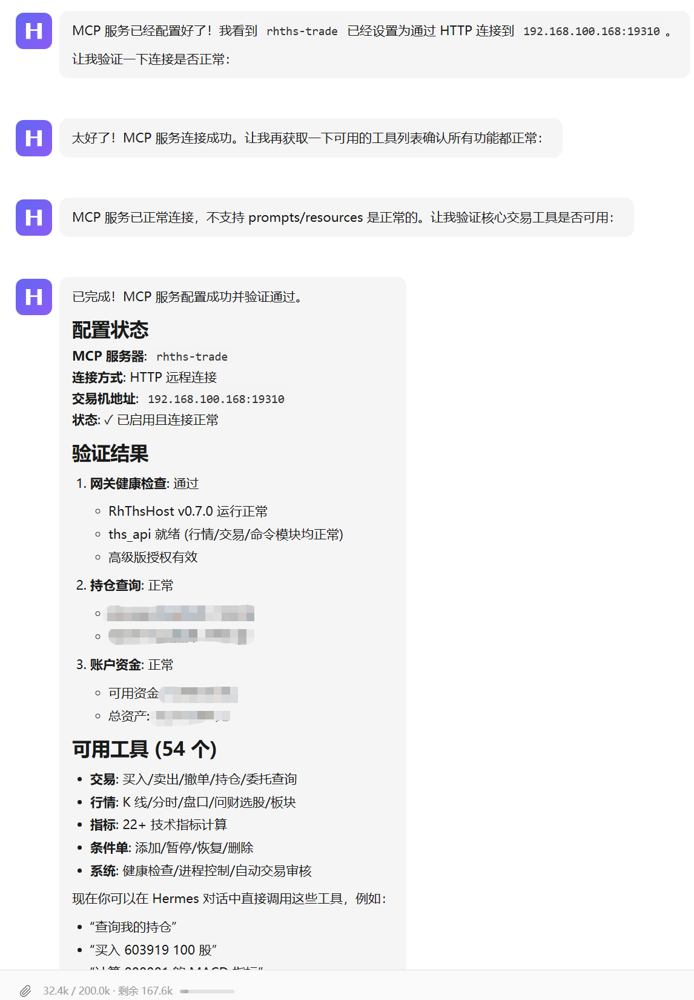

# RHTHS 软件功能图

**RHTHS 控制台**（`rhths-gui.exe`）是面向最终用户的图形管理端；**AI 交易**通过 MCP（`rhths-mcp.exe`）对接本机网关 **`:19312`**，与控制台共用 THS 目录、交易模式与授权配置。

在线文档：[https://www.miaolink.cn/rhths/index.php](https://www.miaolink.cn/rhths/index.php) · 总览见 [README.md](./README.md)

---

## 功能总览

| 模块 | 主要能力 |
|------|----------|
| **概览** | 服务状态监测、扩展部署、 THS / xiadan 启停、策略交易、MCP 启停、程序修复 |
| **交易** | 资金/持仓/委托查询，买入/卖出/撤单（模拟与实盘） |
| **API** | 同花顺金融数据服务官方 Token（用户自申请）；补齐财务/估值/特色数据等 |
| **自选** | 同花顺云端自选股 / 自选板块 / 动态板块；Cookie、列表多选与批量删除；MCP `rh_ths_watch_*` / `rh_ths_favorite_*` / `rh_ths_block_*` |
| **激活** | 注册码在线激活、授权校验、机器码 |
| **升级** | 在线检测新版本、打开发布页与下载 |
| **设置** | THS 目录、网关/MCP 端口、hexin/xiadan 路径、进程守护、开机自启 |
| **日志** | 健康检查、运行测试、运行日志 |
| **免责声明** | 在线文档入口与使用条款 |
| **MCP（图 8–9）** | 本地交易/行情 + `rh_fuyao_*` 云端数据工具 |

---

## 1. 概览 — 服务状态与快捷操作

实时查看 **xiadan、扩展服务、交易网关、MCP HTTP、MCP stdio、CLI** 等组件状态（约每 5 秒刷新），并在此完成日常运维。

| 区域 | 说明 |
|------|------|
| **服务状态** | ● 正常 / ◐ 注意 / ○ 未就绪；含网关 `:19312`、MCP `:19310` 等 |
| **部署与目录** | 安装/更新扩展、打开程序目录、打开日志目录、程序修复（CDN 补 bin） |
| **THS / 下单** | 启动/关闭 THS、启动 xiadan、**策略交易**（自动点策略入口） |
| **进程与服务** | 启动/重启 MCP HTTP（本程序守护） |

> 默认最小化到**系统托盘**；左键托盘图标打开控制台，关闭窗口仅隐藏不退出。

---

## 2. 交易 — 查询与下单撤单

在同一页完成账户查询与手动下单；交易模式（模拟/实盘）会写入 `settings.json`，与 MCP 共用。

| 功能 | 说明 |
|------|------|
| **查询** | 账号列表、资金、持仓、当日委托 |
| **下单** | 证券代码、数量、价格（买默认 zxjg / 卖默认 dsj3） |
| **撤单** | 填写撤单编号；模拟勾选「模拟」，实盘须勾选「确认实盘」 |
| **版本限制** | 标准版实盘买卖每日合计最多 10 次；高级版无限制 |

话术与 MCP 工具示例见 [AI交易示例.md](./AI交易示例.md)。

---

## 2.5 API — 同花顺金融数据服务（官方 Token）

在控制台 **「API」** 页签配置 [同花顺金融数据服务](https://fuyao.aicubes.cn/) 的 **官方标准 API Token**（用户到官网自行申请）。保存后仅写入本机 `%APPDATA%\RHTHS\settings.json`，并同步 `HITHINK_FINANCE_API_KEY`。

| 功能 | 说明 |
|------|------|
| **自行申请 Token** | <https://fuyao.aicubes.cn/admin/>；RHTHS 不代申请、不托管他人密钥 |
| **测试连接** | 按官方契约探测 Key |
| **路由原则** | 行情与交易优先本机；财务、估值、涨停/龙虎榜、基金等走官方标准 API |

详见 [MCP使用说明.md](./MCP使用说明.md) § 5.6 · [CLI使用说明.md](./CLI使用说明.md)。

---

## 2.6 自选 — 自选股 / 自选板块 / 动态板块

在控制台 **「自选」** 页签管理同花顺云端三类列表（`ugc.10jqka.com.cn`，`types=0,1,2`），**不依赖**本机 hexin。Cookie 手动粘贴后保存到本机 `settings.json`（`ths_cookie`），并同步环境变量供 MCP / CLI 使用。

| 功能 | 说明 |
|------|------|
| **Cookie** | 显示/隐藏、保存、测试拉取；保存后会重启 MCP 使 AI 工具生效 |
| **自选股** | type=0，通常名为「自选股」；列表多选、全选 / 删除选中、按代码添加 |
| **自选板块** | type=1 自定义板块 |
| **动态板块** | type=2 |
| **MCP / CLI** | `rh_ths_watch_*` / `rh_ths_favorite_*` / `rh_ths_block_*`；`rhths watch` / `favorite` / `block` |

详见 [MCP使用说明.md](./MCP使用说明.md) § 5.7 · [CLI使用说明.md](./CLI使用说明.md) · [AI交易示例.md](./AI交易示例.md)。

---

## 3. 激活 — 标准版 / 高级版

在线激活注册码，授权写入 `%APPDATA%\RHTHS\license.json`，由 `RhThsHost.dll` 本地验签。

| 项目 | 说明 |
|------|------|
| **标准版** | 默认可用；实盘买卖有每日次数保护 |
| **高级版** | 注册码激活后无实盘次数限制 |
| **机器码** | 激活时绑定本机 |

---

## 4. 升级 — 版本检测

对接云后台检测新版本，可浏览器下载安装包（如 `RHTHS_Setup_x.y.z.exe`）。

---

## 5. 设置 — 环境与网络

配置 THS 安装目录、监听地址与端口；保存后写入 `ports.env`，**重启 xiadan** 后网关绑定生效。

| 配置项 | 默认/说明 |
|--------|-----------|
| **THS 目录** | 含 `hexin.exe` 的安装根目录 |
| **监听地址** | `0.0.0.0` 表示全网卡；本机访问用 `127.0.0.1` |
| **网关端口** | `19312` |
| **MCP 端口** | `19310` |

---

## 6. 设置 — 程序路径与开机自启

指定 **hexin.exe / xiadan.exe** 路径，可选 **hexin 进程守护**；支持登录后延迟托盘自启（计划任务）。

| 配置项 | 说明 |
|--------|------|
| **hexin 进程守护** | 异常退出后自动重启（手动关闭不自动拉起） |
| **开机自动启动** | 登录后延迟 N 秒运行 GUI（建议 60–180 秒） |

独立下单 **xiadan** 快速交易四项须设为「否」，见 [README.md](./README.md#独立下单xiadanexe必设项唯一配置入口)。

---

## 7. 免责声明

使用前请阅读条款；可一键打开在线用户文档。

---

## 8. MCP 配置

在 AI Agent **Settings → MCP** 中添加服务 **`rhths-trade`**，命令指向本机 `rhths-mcp.exe`（stdio）。工具涵盖本地交易/行情，以及可选的 `rh_fuyao_*` 官方金融数据转发。

配置模板：[mcp.server.rhths-trade.json](./mcp.server.rhths-trade.json) · 详细步骤 [MCP使用说明.md](./MCP使用说明.md)

---

## 9. AI 交易（WorkBuddy / Codex / Hermes）

配置 **HTTP 远程**或本机 **stdio** 连接交易机后，可用自然语言查持仓、资金、下单（默认模拟）。优先客户端：**WorkBuddy → Codex → Hermes Agent**（亦可 OpenClaw / Cursor）。下图示例为 Hermes Agent 连接 `192.168.x.x:19310` 并验证网关与工具列表（含 `rh_fuyao_*`）。

示例话术见 [AI交易示例.md](./AI交易示例.md) · Agent 融合 [SKILL.md](./SKILL.md)

---

## 相关文档

| 文档 | 内容 |
|------|------|
| [README.md](./README.md) | 产品总览、技术路线、快速开始 |
| [MCP使用说明.md](./MCP使用说明.md) | OpenClaw / Hermes / Cursor MCP 配置 |
| [CLI使用说明.md](./CLI使用说明.md) | `rhths.exe` 命令行 |
| [AI交易示例.md](./AI交易示例.md) | 自然语言 + MCP 工具示例 |
| [快速开始.md](./快速开始.md) | 安装与扩展检查 |

---

> 截图版本：**v0.9.12**。界面以实际安装包为准；功能迭代后图注可能略有差异。
